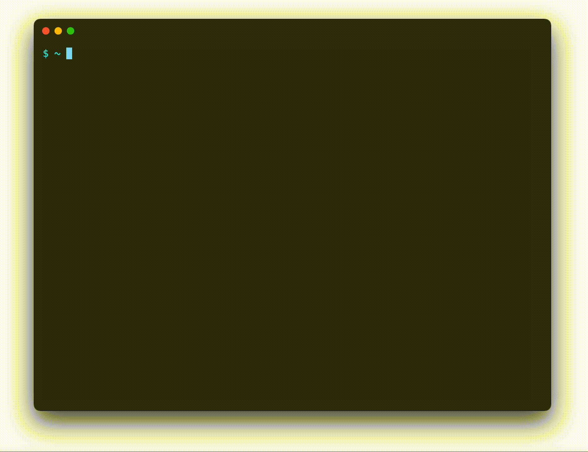

# gchat

Explain your error message in plain English using ChatGPT. Just run your file with the `gchat` command.



## Installation

You can install `gchat` with pip:

```bash
$ pip3 install gchat
```

## Usage

Running a file with `gchat` is just as easy as running it normally:

```bash
# 使用账号密码登录 Openapi 询问
$ gchat [question]
# 使用 Openapi api key 询问
$ gchat -v3 [question]
```

This will execute the file and, if an error is thrown, send the stack trace to ChatGPT and display its explanation in your terminal.

Note that when you first use `gchat`, you'll be asked to enter your OpenAI credentials.

__Supported file types:__ Python, Node.js, Ruby, Golang, and Java.
